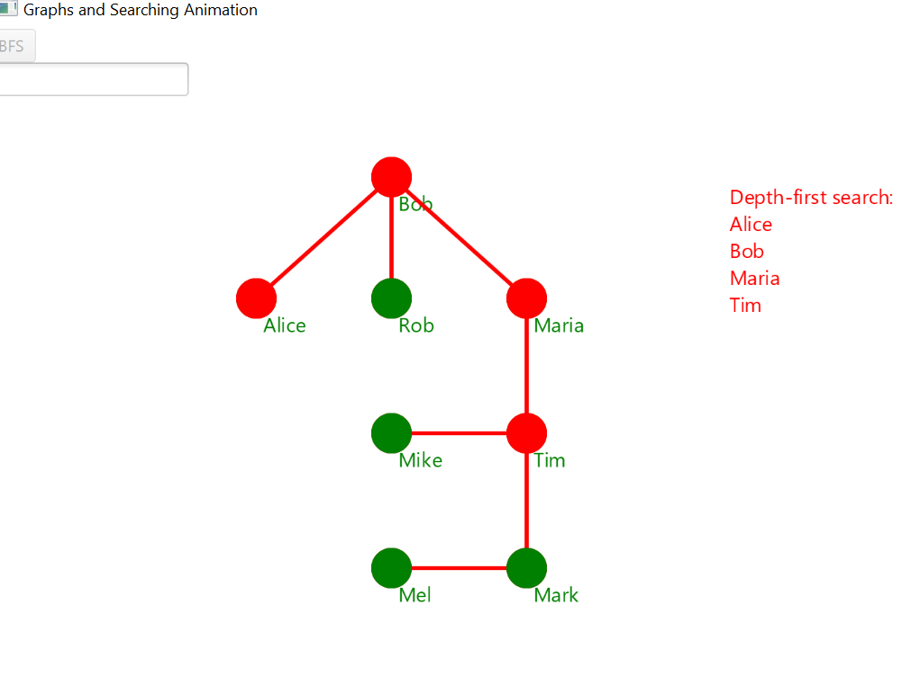
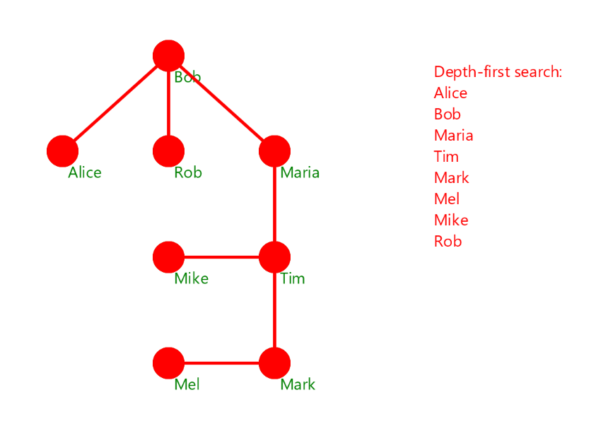

# Searching

An animated traversal of a graph using Depth-First Search or Breadth-First search. The user can input the starting node and the type of search by clicking the relevant button.

### An example of Depth-First search starting at node labelled Alice

As a node is visited its colour is changed to red. This is done on another thread which then sleeps for 1 second. This gives the graph its animation.

